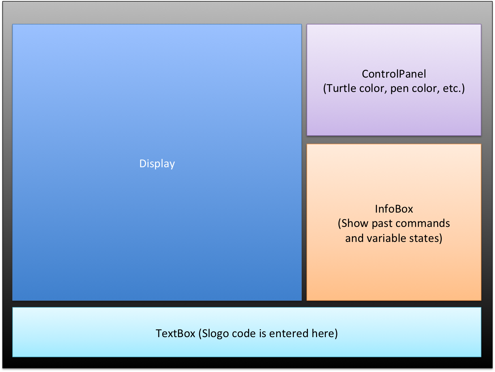

## Introduction
The basic problem of this project is to develop a limited version of the Logo programming language. This involves interpreting commands delivered in LOGO and visually displaying the results of these commands using JavaFX. The primary design goal of this project is to accommodate as many LOGO features as possible by building a program that is not designed for a specific or limited set of commands. The architecture has four key parts. First is a user interface that accepts a list of LOGO commands. Next is a parser that converts LOGO commands to Java objects. These objects will modify the state of a virtual turtle, which is the third component. The final component is a visual display which reflects the state of the turtle. 

##Design Overview

The frontend of this project consists of a Display class displaying the turtle, a TextField class for the user to enter commands, an ErrorHandler class to display messages to the user, and a ControlPanel class containing buttons and menus. 

The internal frontend consists of the control panel, because this panel only modifies front-end components, and does not interact with the backend. The external frontend includes the text field, which sends information to the backend to be parsed. The external frontend also includes the error handler and the display, because they both depend on information from the backend. 

The Parser class is part of the external backend, as it receives text from the user interface. The Parser interacts with internal backend components such as the CommandFactory class. In its getCommand() method, the CommandFactory receives text from the Parser and returns Command objects based on the text. Command is an abstract class containing the basic behavior of a command. There are several extensions of Command, including TurtleCommand (interacts with turtle), ControlCommand (logic control), and EvaluateCommand (commands that return values). These are also abstract classes. Each Command will have an evalute() method. For TurtleCommands evaluate() will modify a Turtle parameter, while for other commands evaluate() may return a numerical value. 

These commands are handled in the evaluateCommands() method of the Controller class, which is an external backend component. The Controller class evaluates commands and passes the results to the Display. Depending on the command these results could be TurtleState objects or numerical/text values. To handle TurtleCommands Controller contains Turtle objects which are modified by commands. Turtles will have a move() function which can be called by TurtleCommands to modify the location of the Turtle. Turtle information is contained in a TurtleState object, which includes the location and orientation of the Turtle. Each Turtle contains a Collection of TurtleState objects so that the previous, current, and next states of the Turtle are known. The Controller passes TurtleStates to the Display, which updates the visual display based on these TurtleStates. This updating takes place in the update() method of the display. 
Each component in the backend will throw Exceptions that we will write to handle specific error cases. Example errors include syntax errors, type errors, incorrect number of parameters to a function, and mathematical errors. These exceptions will be thrown in the backend and caught by the ErrorHandler class, which will display the message associated with that exception. 

Overall, the backend is constructed to deliver information to the frontend in as simple a format as possible. For this reason the whole process of executing commands and updating states is handled by the Command subclasses and the controller. That way, the frontend receives a concise and simple representation of TurtleStates that are easy to display visually.

##User Interface

Here is a quick sketch of the user interface:

The user will interact with the program via a series of buttons within the control panel class which will allow the user to set various global properties that affect the display of the program. In addition, users will enter commands through a textbox that will send a string to the parser class. 

The display class will show updates of the turtle’s status, and it will include animations for the turtle as it moves according to the input commands. Previous commands can be seen in the InfoBox panel, as well as the state of variables.

Furthermore, errors will be highlighted in the infobox and produce a popup display signifying what type of error has occurred. 

Each of the previous components will live in its own panel and have its own class, both to streamline the UI and modularize the code that underlies it. 

## API Details

### Internal Frontend
The internal frontend will allow updating of the visuals and serves as the connection between the UI buttons, display, and other components of the frontend. The internal frontend will require a properties file which specifies the text for buttons and labels as well as Controller to receive updates from. The purpose of the internal frontend is to separate and encapsulate the various components that comprise the window into separate classes, such as ControlPanel for buttons, the Display for representing the turtle’s actions, and the TextBox for the display and markdown of user entered text. 
* ControlPanel.java: Contains functions to modify visual 
	* void addButton() // Adds a button with a specified text and action to the Control Panel

###External Frontend
The external frontend is responsible for passing user input to the backend, and displaying the results of the backend visually. The main function of the components below is to pass and receive information. All the execution is done in the backend. The reason for this decision is that the visual display is based only on changes in state of turtles. Therefore, any new commands or functions will be viewed as changes in state that can be executed in backend, without the need to change the frontend. 
* TextBox.java: Holds user text and passes it to Parser
	* Collection<String> Commands
	* TextField text //The actual JavaFX component for receiving text
	* run() //Stops accepting new commands and passes commands to parser

* Display.java: Displays state of the Turtle
	* update()
	* setBackground()
	* setPenColor()
	* setPenWidth()

###Internal Backend
The internal backend consists of the components that don’t interact with the frontend at all. We had only one such component, which was the CommandFactory. We chose to use a Factory design for extensibility purposes. With a factory, the whole process of translating parsed text into commands is encapsulated in one class, so when adding new commands all that has to be done is create a new subclass of Command. This leaves the rest of the backend closed to modification when new Commands are created.
* CommandFactory.java
	* getCommand(String input) //returns a command object based on string

####External Backend
The external backend will support allowing user-entered text commands to be passed to the backend and returning updates to the frontend to display. The backend uses a Turtle with a collection of TurtleStates to represent a turtle in Slogo, and can be extended to include multiple turtles. The commands for the turtle are encoded in a Command object, which is subdivided into hierarchies, such as TurtleCommand and ControlCommand, which contain their corresponding Command subclasses. Command can be extended to include additional commands by making additional command subclasses. Commands are created with a CommandFactory, which follows the factory design philosophy. The use of TurtleState allows for all the Turtle’s state information to be encoded in one object, which lets it be easily interpreted and analyzed.
* Controller.java
	* evaluateCommands(s)
	* getTurtles() //returns turtles to frontend

* Parser.java
	* parse(Collection<String> logos) //Converts logo code to a parsed format
* initCommands() //Sends parsed commands to CommandFactory to initialize    commands
* getCommands()

* Turtle.java
	* List<TurtleState> getStates() //returns all states of this Turtle
	* move(boolean direction, int distance) //changes location of turtle
	* rotate(int degrees)

* TurtleState.java: Contains location and orientation of a Turtle

### Exception Handling

Currently, we expect to generate various forms of command exception. We expect we’ll throw “incorrect command” exceptions and “incorrect argument” exceptions, but the latter will encompass errors such as attempting to divide by zero, passing in a negative logarithmic value, or more standardly, passing in the wrong number or type of parameters. Though each of these will be its own exception type, we intend to create them as a subclass of argument exceptions. 

Exceptions include: 
* Incorrect number of parameters passed to a command
* Mathematically invalid parameters (ex. divide by 0)
* Syntax error (typos, forgot brackets, spacing error)
* Incorrect type of parameter
* Variable not found: reference to a variable that has not been defined yet

##API Example Code

Given use case *The user types 'fd 50' in the command window, and sees the turtle move in the display window leaving a trail, and the command is added to the environment's history*:
Inside TextBox, the submitText() function is called when the submit button is pressed.
Inside Parser, the split() and parse() functions are called, which split the input into discrete lines (if it’s a multi-line input) and then parse each line. Then, the pushCommandToInfoBox() function is called, which adds a command to the infobox history with modifiers depending on whether it was a successfully executed line or not.
Assuming that the input was valid, the CommandFactory class runs the createCommand() function. If the input was not valid, then the ErrorHandler class runs the createError() method, which makes a popup window detailing what the error was. Every subsequent step in this flowchart assumes that the input is valid.
Inside the Controller, the evaluateCommands() function is run. This command updates the state of the turtles stored in the Collection<Turtle> allTurtles.
Inside the Display, the step() function is called every x milliseconds. The step() function calls various other functions, the most important of which is the updateVisualState() function which gets relevant information from the Controller and updates the display itself.

Use Case: User has commands written and hits “run” → What happens in parser?
TextBox.java calls run(), passing commands to a Parser object as a Collection of Strings
Parser.java calls parse(), which reads in the Strings passed in and initializes another Collections of Strings in a parsed format
For each command, Parser calls CommandFactory.getCommand(), and initializes an ordered Collection of Command objects 

Use Case: Suppose that a user decides to change the color of the turtle.
changeColor() inside the ControlPanel class is called.
updateColor() inside the Controller class is called, which updates the turtle’s color in the back end.
At the next iteration of step() in the Display, the newest information from the Controller class will be pulled, and the color will be updated in the display.

Use Case: The command to rotate 60 degrees is passed from Parser to the Controller through the Controller’s evaluateCommands() method → What happens in the backend?
The Controller calls on the Command’s evaluate() method.
Because it is a turtleCommand, the command’s evaluate() calls rotate() on the Turtle it is attached to and passes in the degrees to rotate.
The turtle updates it’s orientation field and adds a new entry to its turtleStates list.

Use Case: quotient 8 / 0
submitText() is called within Textbox when the submit button is pressed. 
split() and parse() are called within parser()
error handler class runs createError() due to divide by zero

## Design Considerations

Before a complete design solution could be devised, we had to determine how to add new properties to the Turtle, or whether we can just include all possible properties initially in the Turtle. Though the former would likely be more extensible, it may end up being unnecessary especially since each turtle appears to have few attributes attached to it. Additionally, we had to determine how we wanted to separate the various components between the front end or back end as well as how to represent information within the two. In the end, we opted to provide a means for adding new properties to Turtle and creating a Controller class in the back end to centralize information and pass said information to a similarly centralized Display class in the front end. 

Once this was determined, the way in which the information would be passed could be decided upon. Though we had decided on a Parser structure to handle the transfer of string inputs from the frontend into a structure that could be processed by the backend. When we decided these inputs would come in the form of a list of strings, we discussed what type of coding structure would be required for the Parser to both recognize a String as a given command as well as process a series of commands in the correct order. Moreover, consideration had to be given to whether such a structure would be readily extensible as well. As a result, the concept of a CommandFactory was decided upon. This CommandFactory was intended to hold a lot of the nastier logic involved in creating and instantiating various Commands while simultaneously being able to populate the inputs and outputs of the Commands with their desired parameters. 

## Team Responsibilities
The front end will be tackled by Bobby and Hayden. Bobby will be in charge of the Display and TextBox classes. Hayden will be in charge of the ErrorHandler and InfoBox classes, as well as extending support for multiple languages. The various back end components will be handled by Saumya and Austin. They will work together to implement the parser, controller, and various command classes. The front and back end teams will work concurrently, and they will remain in close contact with one another in case design specifications change.
